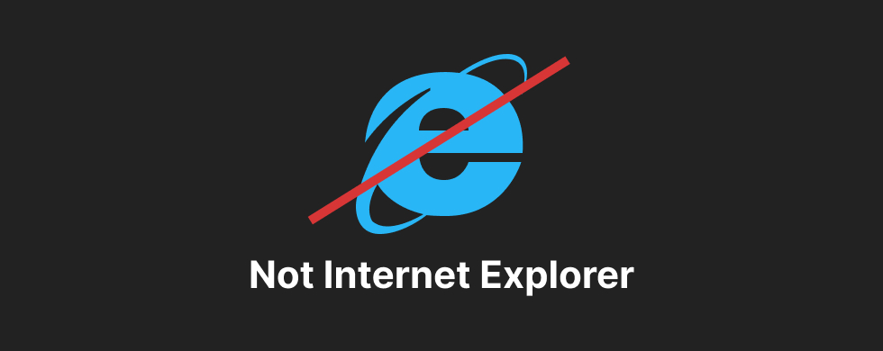

# Заглушка для IE
Заглушка использует подход обнаружение поддержки браузерами свойства `classList`(<=ie9) и `closest`(<=ie11).
Все подробности можно найти в этой [статье](https://developer.mozilla.org/en-US/docs/Archive/Using_Web_Standards_in_your_Web_Pages/Developing_cross-browser_and_cross-platform_pages).


Примеры заглушки:
* [`<=IE9`](https://doshirakfood.github.io/rejectIE/classList.html);
* [`<=IE11`](https://doshirakfood.github.io/rejectIE/closest.html).


## <=IE9
Используется подход обнаружение поддержки свойства `classList`.

```js
  var html = document.documentElement; 

  if (!html.classList) {

    html.className = 'html-not-ie';
  
  }
```


## <=IE11
Если необходимо показать заглушку на всех версиях IE, то для обнаружение поддержки, можно использовать свойство `сlosest`.

```js
  var html = document.documentElement; 

  if (!html.closest) {

    html.className = 'html-not-ie';
  
  }
```